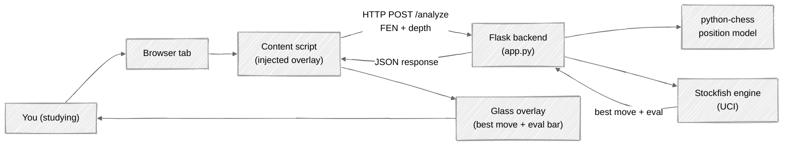
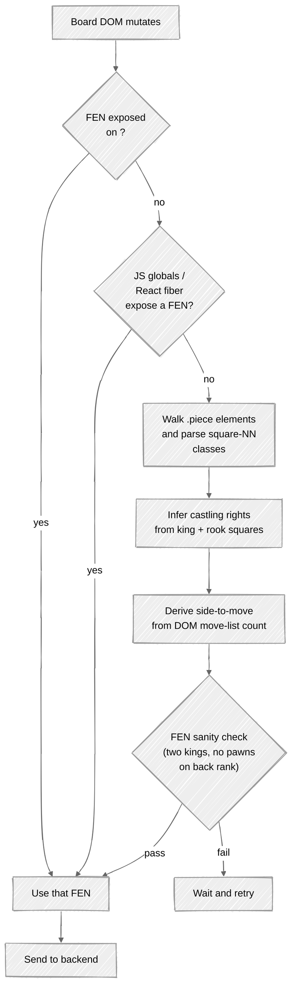
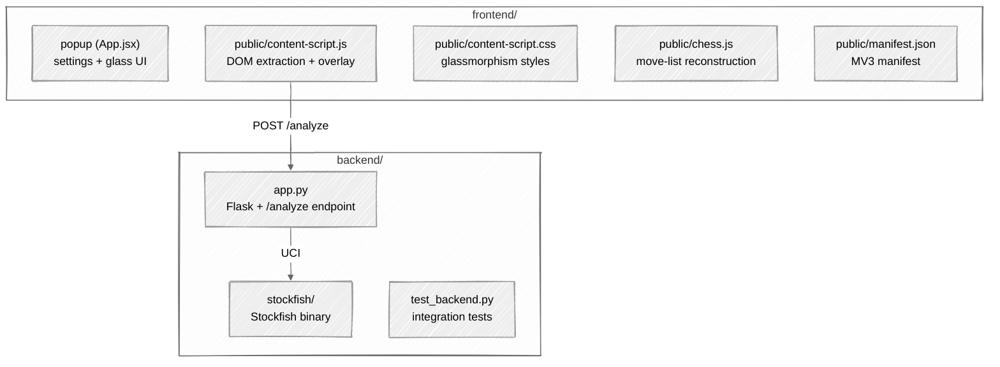

# Chess Study Overlay

A personal study tool that pairs a local Stockfish engine with a Chrome extension. You bring a chess position into your browser, the extension reads the board, the local backend asks Stockfish what it thinks, and a glass overlay shows the suggested move with a live evaluation bar.

> **For learning and personal study only.** Do **not** use this against live rated opponents. See the [Fair Play and Legal Notes](#fair-play-and-legal-notes) section before anything else.

---

## Table of Contents

1. [What this is (and is not)](#what-this-is-and-is-not)
2. [Intended use cases](#intended-use-cases)
3. [Architecture](#architecture)
4. [Features](#features)
5. [Prerequisites](#prerequisites)
6. [Backend setup](#backend-setup)
7. [Frontend setup](#frontend-setup)
8. [Install as a Chrome extension](#install-as-a-chrome-extension)
9. [How to use it](#how-to-use-it)
10. [How it works under the hood](#how-it-works-under-the-hood)
11. [Running the tests](#running-the-tests)
12. [Troubleshooting](#troubleshooting)
13. [Fair Play and Legal Notes](#fair-play-and-legal-notes)
14. [License](#license)

---

## What this is (and is not)

**It is** a learning aid. You can set up positions, replay your own saved games, run through puzzles, and see what a strong engine thinks — all from inside your browser. The overlay is designed to feel like a quiet second opinion while you study.

**It is not** a cheating tool. It is not meant to sit on top of a live rated chess.com game so you can win by copying moves. That use violates chess.com's Fair Play policy and will get your account banned. The project is published in the hope that it helps students understand positions better, not to enable cheating.

---

## Intended use cases

Good uses:

- Reviewing a finished game on an analysis board
- Studying a position set up on an offline board or the Chess.com Learn/Puzzles sections (outside of rated play)
- Practising openings against the computer on your own device
- Running it against your own local chess GUIs where the TOS of the host does not prohibit engine assistance

Not intended:

- Live rated games against humans on any platform
- Tournament play, online or over-the-board
- Any use where engine assistance is against the rules of the site or event

If you are in doubt, do not use it.

---

## Architecture

A high-level view of how a position gets from your browser to Stockfish and back.



ASCII fallback if your Mermaid renderer is old:

```
+-------------+       +--------------------+       +---------------------+
|  You study  | <---> |   Browser tab      | <---> |  Content script     |
|  a position |       |   (chess board)    |       |  (reads DOM, draws  |
+-------------+       +--------------------+       |   glass overlay)    |
                                                   +----------+----------+
                                                              | HTTP POST
                                                              v
                                                   +---------------------+
                                                   |  Flask backend      |
                                                   |  (app.py)           |
                                                   +--+----------+-------+
                                                      |          |
                                                      v          v
                                              +-------------+  +----------------+
                                              | python-chess|  | Stockfish UCI  |
                                              |  legality   |  |  search engine |
                                              +-------------+  +----------------+
```

### The extraction pipeline inside the content script

The overlay only works if it can read the position. Browsers paint chess boards in many ways, so the script tries several sources and validates the result before trusting it.



### Component map



---

## Features

- Live best-move suggestion with SAN notation
- Evaluation bar that maps pawn advantage through `tanh(cp / 3)` to a width percentage, plus mate-in-N handling
- Glassmorphism overlay with premium stroke-only SVG icons (no emojis)
- Glass popup for enabling/disabling the overlay, setting depth, and configuring the backend URL
- Deterministic analysis: the same FEN always yields the same suggestion (guarded by a 30-second cache and a regression test)
- Robust extraction: attribute-based FEN, React-fiber probing, light-DOM piece walk with castling inference, and a DOM-based side-to-move counter
- FEN sanity validation rejects mid-animation snapshots that would otherwise confuse the engine

---

## Prerequisites

- Python 3.10 or newer
- Node.js 18 or newer
- Google Chrome (or a Chromium-based browser that supports MV3 extensions)
- Stockfish — a Windows AVX2 build is already committed under `backend/stockfish/`. On macOS or Linux, install your platform's Stockfish package and point `backend/app.py` at it.

---

## Backend setup

From the `backend/` folder:

```bash
python -m venv venv
# Windows
venv\Scripts\activate
# macOS / Linux
source venv/bin/activate

pip install -r requirements.txt
python app.py
```

The server listens on `http://localhost:5000`. Open that URL in a browser — you should see a small JSON banner with the available endpoints.

---

## Frontend setup

From the `frontend/` folder:

```bash
npm install
npm run dev
```

This starts the Vite dev server (usually `http://localhost:5173`) so you can iterate on the popup UI without rebuilding the extension.

---

## Install as a Chrome extension

1. From the `frontend/` folder, run `npm run build`. This produces `frontend/dist/`.
2. In Chrome, open `chrome://extensions`.
3. Enable **Developer mode** (top-right toggle).
4. Click **Load unpacked** and select the `frontend/dist` folder.
5. Make sure the backend is running, then open a chess page. The overlay appears in the top-right of the tab.

Whenever you rebuild, come back to `chrome://extensions` and click the reload icon on the extension card — Chrome caches the old content script until you do.

---

## How to use it

1. Start the backend (`python app.py`).
2. Open the chess page you are studying (analysis board, puzzle, offline game, saved game review — not a live rated match).
3. The glass overlay attaches in the top-right of the page.
4. The suggested-move card updates after each half-move. The evaluation bar fills toward the side that is better; a mate score collapses it to one end.
5. Open the extension popup to toggle the overlay, change depth (10/15/20), or point at a different backend URL.

If the overlay ever says *Board not detected*, open DevTools on the tab and run `window.__chessAnalysisDebug()` in the console. It returns a JSON blob showing what the extractor sees, which is the fastest way to diagnose extraction problems.

---

## How it works under the hood

**Position extraction.** The content script watches `chess-board` and related custom elements for DOM mutations, then tries (in order) an exposed FEN attribute, known chess.com JS globals and React fiber props, and finally a walk of `.piece` elements whose coordinates are encoded in `square-NN` class names. Castling rights are inferred from king and rook starting-square occupancy; side-to-move is derived from the actual half-move count in the DOM move list.

**Analysis.** The backend is a small Flask app that hands the FEN to Stockfish over UCI. It configures Stockfish with 512 MB of hash, four threads, and MultiPV for candidate lines; it increases depth slightly for tactical positions (checks, many captures, many checks). Results are cached for 30 seconds keyed on `(fen, forced_turn, depth)`, so repeated requests for the same position are free and, critically, deterministic.

**Display.** The content script renders a glass-morphism panel with a gradient move, a tanh-scaled evaluation bar (`pct = 50 + 50 * tanh(pawns / 3)`), and a status pill that reflects *idle / thinking / ready / error*. The popup uses the same visual language.

**Why the suggestions are correct.** Stockfish at even modest depth is far stronger than any human; almost every "weak suggestion" in tools like this comes from sending the engine a wrong position, not a weak engine. The extraction pipeline above exists specifically to never hand Stockfish a FEN with the wrong side-to-move, missing castling rights, or a mid-animation piece snapshot.

---

## Running the tests

The backend comes with an integration test suite that exercises health, determinism (same FEN → same move), cache behaviour, move-list input, mate detection, tactical quality, invalid inputs, and `sideToMove` forcing.

In one terminal:

```bash
cd backend
venv/Scripts/python app.py      # or source venv/bin/activate && python app.py
```

In another:

```bash
cd backend
venv/Scripts/python test_backend.py
```

You should see `13/13 checks passed` (or more as the suite grows).

---

## Troubleshooting

**"Stockfish engine not found".** Check that the binary under `backend/stockfish/` is present, or edit the `possible_paths` list in `backend/app.py` to point at your system Stockfish.

**Overlay says "Board not detected".** Run `window.__chessAnalysisDebug()` in the page's DevTools console. The report tells you whether any `.piece` elements were found and what their class lists look like.

**Overlay never updates.** Ensure the backend is running (`curl http://localhost:5000/health`), that the extension was reloaded after your last `npm run build`, and that the page URL matches one of the patterns in `frontend/public/manifest.json`.

**The suggestion keeps flipping between two moves for the same position.** This was a real bug in earlier revisions; if you see it again, the 30-second cache has been bypassed. File an issue with the FEN and the two moves you saw.

---

## Fair Play and Legal Notes

Please read this carefully before using or sharing this project.

### Using this with live rated games is cheating

Chess.com's Fair Play policy prohibits the use of engines, databases, or any external assistance during live rated games. This is true of essentially every online chess site. Running this overlay during a rated game is cheating, and it will get your account closed.

This project is shared in good faith for study and learning. If you use it to cheat, that is on you, not on this project.

### Not affiliated with Chess.com

This project is an independent personal tool. It is not affiliated with, endorsed by, or sponsored by Chess.com, LLC. "Chess.com" is a trademark of Chess.com, LLC and is referenced here only to describe where the extension's content script can run.

### The extension reads the DOM only

This project does not break encryption, bypass paywalls, hit private APIs, scrape premium content, or modify Chess.com's servers in any way. It reads the chess board DOM that is already rendered in your own browser tab and sends that position to a local server running on your own machine. Nothing leaves your computer.

That technical fact does not, however, override Chess.com's Terms of Service: the ToS forbid using automated tools or engine assistance during play regardless of how the position is read.

### If you open-source this

If you fork or republish this project, do the following to keep everyone on the right side of the rules:

- Keep the "learning only" disclaimer at the top of the README.
- Do not rename the project to something that implies it is a cheating tool.
- Do not include screenshots or demos of the overlay running during a live rated game.
- Consider narrowing the `content_scripts.matches` patterns in `frontend/public/manifest.json` so the overlay only attaches to analysis and puzzle pages, not to live game URLs. That is a meaningful signal that the project is positioned as a study tool.

Chess.com has historically asked GitHub to take down projects that are marketed as cheating aids for their site. A clearly-scoped study tool with prominent disclaimers is far less likely to attract that kind of attention, but there is no guarantee.

### No warranty

This software is provided "as is", without warranty of any kind. The author is not responsible for account bans, lost ratings, disciplinary action, or any other consequence of how this project is used. By using it you accept that risk.

---

## License

MIT. See `LICENSE` (add one before publishing). The MIT license is compatible with Stockfish's GPL-3.0 as long as Stockfish is distributed as a separate executable, which is how this project already uses it — the Python backend invokes Stockfish over UCI rather than linking against it.
